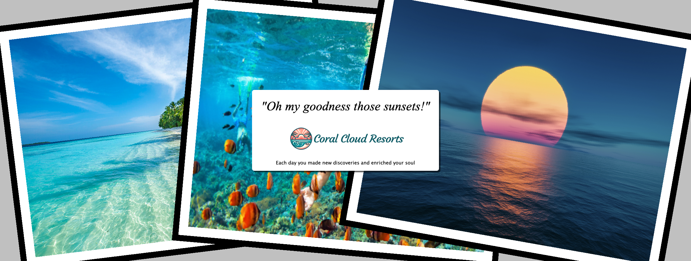

Extending the Coral Cloud Agent with Heroku - Heroku Integration Edition
========================================================================

> **DO NOT SHARE:** This is internal version of the public demo, this is being used to explore integrating the Heroku Integration pilot.

This demo extends the popular [Coral Cloud demo](https://trailhead.salesforce.com/content/learn/projects/quick-start-explore-the-coral-cloud-sample-app) by extending the Coral Cloud Agent with the ability to dynamically generate a custom collage of the guests stay. You can watch a short demo video [here](https://www.youtube.com/watch?v=yd97A9GLFUA). Also if you missed our other Agentforce demo you can still catchup through [this](https://blog.heroku.com/building-supercharged-agents-heroku-agentforce) blog and associated video and sample code.

